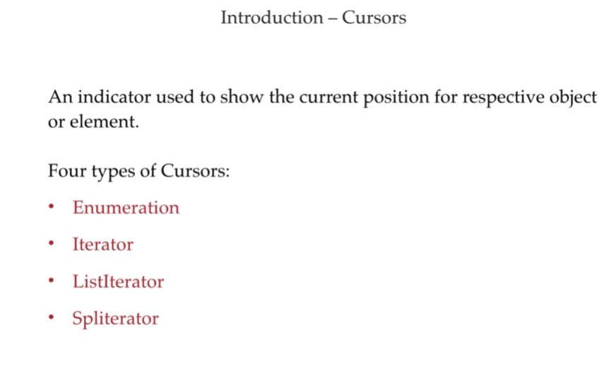
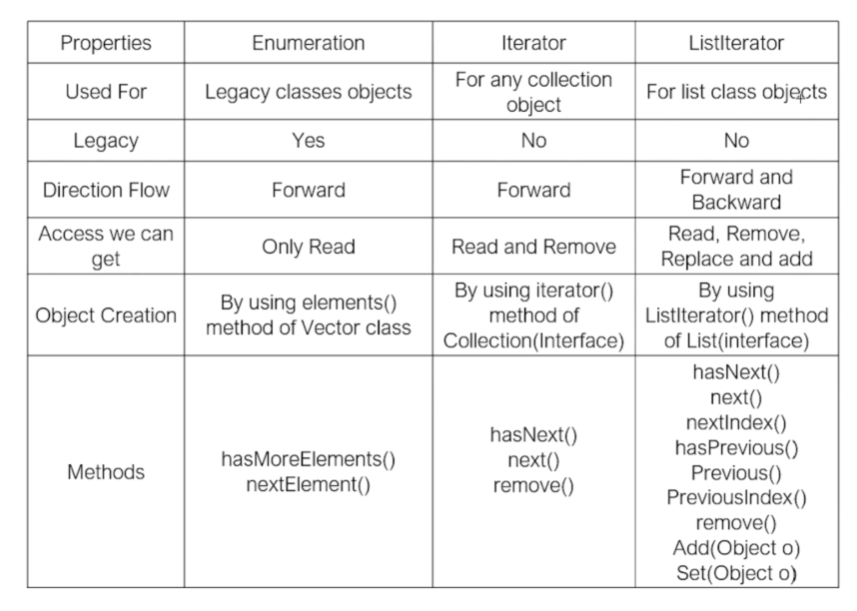

# Java Cursors

---

An indicator used to show the current position for respective object or element in a Collection. 
In Java, there are four main types of cursors used to retrieve or traverse elements:



1. **Enumeration**
2. **Iterator**
3. **ListIterator**
4. **Spliterator**

---

## 1. Enumeration
- **Introduced:** Java 1.0 (Legacy).
- **Usage:** Used to get elements one by one from legacy collections like `Vector`, `Hashtable`, `Stack`, `Properties`.
- **Direction:** Forward-only.
- **Operations:** Read-only (cannot remove elements while traversing).
- **Key Methods:** `hasMoreElements()`, `nextElement()`.

**Example:**
```java
import java.util.Enumeration;
import java.util.Vector;

public class EnumerationExample {
    public static void main(String[] args) {
        Vector<Integer> vector = new Vector<>();
        vector.add(10);
        vector.add(20);
        vector.add(30);

        // Getting the enumeration cursor
        Enumeration<Integer> e = vector.elements();
        
        while (e.hasMoreElements()) {
            System.out.println(e.nextElement());
        }
    }
}
```

---

## 2. Iterator
- **Introduced:** Java 1.2 (Universal Cursor).
- **Usage:** Can be used with any collection class (e.g., `ArrayList`, `HashSet`, `LinkedList`).
- **Direction:** Forward-only.
- **Operations:** Read and Remove.
- **Key Methods:** `hasNext()`, `next()`, `remove()`.

**Example:**
```java
import java.util.ArrayList;
import java.util.Iterator;
import java.util.List;

public class IteratorExample {
    public static void main(String[] args) {
        List<String> list = new ArrayList<>();
        list.add("Apple");
        list.add("Banana");
        list.add("Cherry");

        // Getting the iterator
        Iterator<String> iterator = list.iterator();
        
        while (iterator.hasNext()) {
            String fruit = iterator.next();
            if (fruit.equals("Banana")) {
                iterator.remove(); // Safely removes "Banana"
            } else {
                System.out.println(fruit);
            }
        }
    }
}
```

---

## 3. ListIterator
- **Introduced:** Java 1.2.
- **Usage:** Used only for `List` implemented classes (like `ArrayList`, `LinkedList`, `Vector`).
- **Direction:** Bi-directional (Forward and Backward).
- **Operations:** Read, Remove, Replace (set), and Add.
- **Key Methods:** `hasNext()`, `next()`, `hasPrevious()`, `previous()`, `add()`, `set()`, `remove()`.

**Example:**
```java
import java.util.ArrayList;
import java.util.List;
import java.util.ListIterator;

public class ListIteratorExample {
    public static void main(String[] args) {
        List<String> list = new ArrayList<>();
        list.add("A");
        list.add("B");
        list.add("C");

        // Getting the ListIterator
        ListIterator<String> listIterator = list.listIterator();
        
        System.out.println("Forward Traversal:");
        while (listIterator.hasNext()) {
            System.out.println(listIterator.next());
        }

        System.out.println("\nBackward Traversal:");
        while (listIterator.hasPrevious()) {
            System.out.println(listIterator.previous()); // Output: C, B, A
        }
    }
}
```

---

## 4. Spliterator
- **Introduced:** Java 8.
- **Usage:** Used for parallel iteration (processing elements concurrently). It can be used with collections, arrays, or custom data sources.
- **Direction:** Forward-only.
- **Characteristics:** Designed for parallel processing and streams. It can split elements into multiple parts using `trySplit()`.
- **Key Methods:** `tryAdvance()`, `forEachRemaining()`, `trySplit()`, `estimateSize()`.

**Example:**
```java
import java.util.ArrayList;
import java.util.List;
import java.util.Spliterator;

public class SpliteratorExample {
    public static void main(String[] args) {
        List<Integer> list = new ArrayList<>();
        list.add(1);
        list.add(2);
        list.add(3);
        list.add(4);

        // Getting the spliterator
        Spliterator<Integer> spliterator = list.spliterator();
        
        // Processing a single element (similar to iterator.hasNext() + next())
        spliterator.tryAdvance(n -> System.out.println("Processed one: " + n));

        // Processing the remaining elements
        spliterator.forEachRemaining(n -> System.out.println("Remaining: " + n));
    }
}
```


---

<div align="left">
  <a href="../List-Revision-Notes"><kbd>⬅️ Previous: List Interface</kbd></a>
</div>