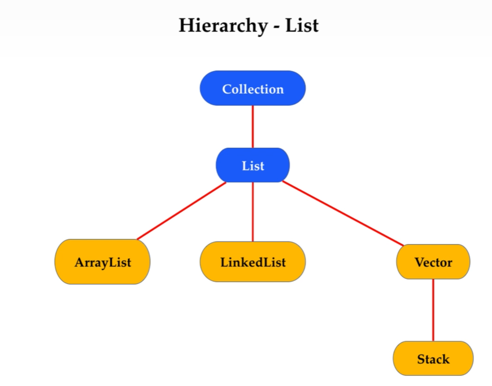
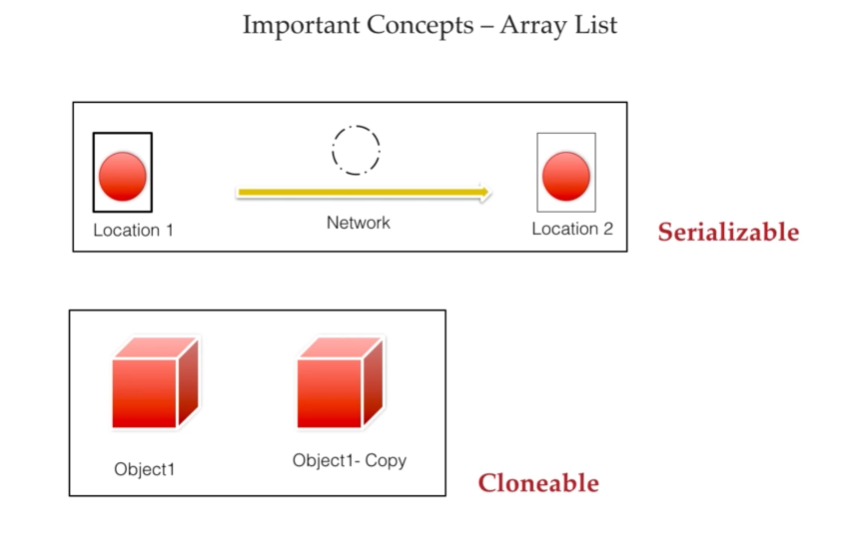
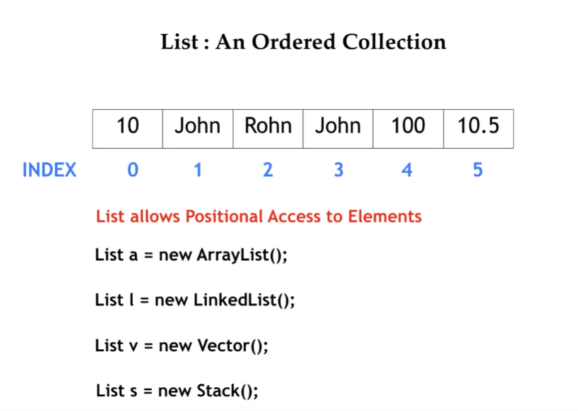
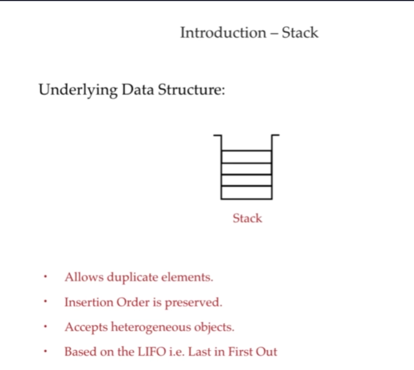
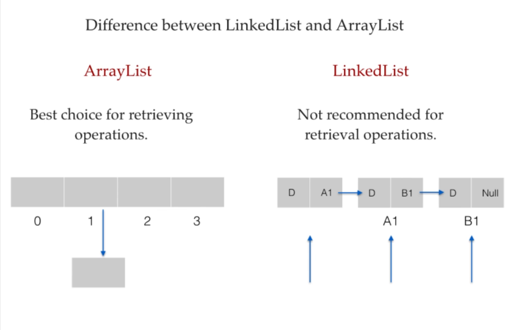
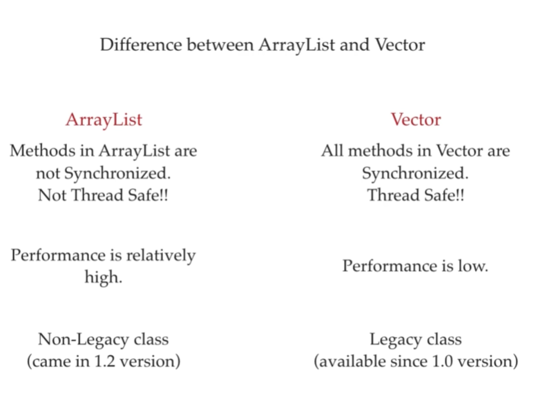

# Java List Interface - Revision Notes

<div align="right">
  <a href="Cursor/Cursor-Revision-Notes.md"><kbd>Next: Cursors &amp; Iterators ➡️</kbd></a>
</div>

---

## 1. Introduction
- **`List`** is an interface in the Java Collections Framework (part of `java.util` package).
- It extends the `Collection` interface.
- **Key Characteristics:**
  - **Ordered Collection:** Maintains the insertion order of elements.
  - **Duplicates Allowed:** It can contain duplicate elements and `null` values.
  - **Positional Access:** Elements can be accessed, inserted, or removed using an integer index (0-based).



## 2. Common Implementations
The most widely used classes that implement the `List` interface are:

1. **`ArrayList`**
   - Resizable-array implementation.
   - **Fast for:** Random access and retrieval (using index). `O(1)` time complexity.
   - **Slow for:** Insertions and deletions (especially in the middle), as it requires shifting elements.
   - **Not Thread-Safe.**
    
> **Note** : The size of a arraylist is resizable. Initially it is 10 and for 10 elements it will take 8 bytes of space. Now if the 10 size is full, a new array list will be created with increased size (50% of current size) and the old array list will be garbage collected. This is the main reason for slow performance of arraylist during insertion and deletion.Arraylist implements both serializable and clonable interfaces. This can be shown in the diagram.




- **How to create an `ArrayList`:**
```java
// 1. Using default constructor (Initial capacity is 10)
List<String> list1 = new ArrayList<>();

// 2. Specifying initial capacity (Useful if you know the approximate size)
List<Integer> list2 = new ArrayList<>(50);

// 3. Creating from another existing collection
List<String> list3 = new ArrayList<>(list1);

// 4. Using Arrays.asList (pre-Java 9)
List<String> list4 = new ArrayList<>(Arrays.asList("A", "B", "C"));

// 5. Using List.of (Java 9+)
List<String> list5 = new ArrayList<String>(List.of("X", "Y", "Z"));
```

2. **`LinkedList`**
   - Doubly-linked list implementation.
   - **Fast for:** Insertions and deletions, as it only requires updating pointers. `O(1)` time complexity if the node is known.
   - **Slow for:** Random access, as it must traverse the list from the beginning or end. `O(n)` time complexity.
   - **Not Thread-Safe.**
   - Also implements the `Deque` interface.

- **How to create a `LinkedList`:**
```java
// 1. Using default constructor
List<String> linkedList1 = new LinkedList<>();

// 2. Adding initial values
LinkedList<String> linkedList2 = new LinkedList<>();
linkedList2.add("A");
linkedList2.add("B");
linkedList2.add("C");

// 3. Creating from another collection
List<String> linkedList3 = new LinkedList<>(list1);

// 4. Using Arrays.asList
List<String> linkedList4 = new LinkedList<>(Arrays.asList("X", "Y", "Z"));

// 5. Using List.of (Java 9+)
List<String> linkedList5 = new LinkedList<>(List.of("P", "Q", "R"));
```

> **Note**: `LinkedList` is useful when you need frequent insertions or deletions from the beginning or middle of the list, while `ArrayList` is better for faster indexed access.

3. **`Vector`**
   - Similar to `ArrayList` (resizable array).
   - **Thread-Safe (Synchronized):** Safe for use in multi-threaded environments, but performance is slower due to synchronization overhead.
   - Considered a legacy class.

- **How to create a `Vector`:**
    ```java
    // 1. Using default constructor (Initial capacity is 10)
    Vector<String> vector1 = new Vector<>();
    
    // 2. Specifying initial capacity
    Vector<Integer> vector2 = new Vector<>(50);
    
    // 3. Specifying initial capacity and capacity increment
    // (increases by 5 elements when full instead of doubling)
    Vector<String> vector3 = new Vector<>(10, 5);
    
    // 4. Creating from another collection
    Vector<String> vector4 = new Vector<>(list1); // Assuming list1 exists
    ```

- **Commonly used `Vector` methods** (in addition to standard `List` methods):
    - `addElement(E obj)`: Adds the specified component to the end of this vector.
    - `removeElement(Object obj)`: Removes the first occurrence of the argument from this vector.
    - `elementAt(int index)`: Returns the component at the specified index.
    - `firstElement()`: Returns the first component (the item at index 0) of this vector.
    - `lastElement()`: Returns the last component of the vector.
    - `capacity()`: Returns the current capacity of this vector (different from `size()`).
   
4. **`Stack`**
   - Subclass of `Vector`.
   - Represents a Last-In-First-Out (LIFO) stack of objects.
   - Key methods: `push()`, `pop()`, `peek()`

    - **How to create a `Stack`:**
    ```java
    // 1. Using default constructor
    Stack<String> stack1 = new Stack<>();

    // 2. Adding elements to the stack
    stack1.push("First");
    stack1.push("Second");

    // 3. Creating and populating from another collection
    Stack<String> stack2 = new Stack<>();
    stack2.addAll(list1); // Stack inherits addAll from Vector

    ```

 **Commonly used `Stack` methods:**

    - `push(E item)`: Pushes an item onto the top of this stack.
    - `pop()`: Removes the object at the top of this stack and returns that object as the value of this function.
    - `peek()`: Looks at the object at the top of this stack without removing it from the stack.
    - `empty()`: Tests if this stack is empty (returns a boolean).
    - `search(Object o)`: Returns the 1-based position where an object is on this stack (returns -1 if not found).



## 3. Key Methods in `List` Interface

| Method | Description |
| :--- | :--- |
| `add(E e)` | Appends the element to the end of the list. |
| `add(int index, E element)` | Inserts the element at the specified position. |
| `get(int index)` | Returns the element at the specified position. |
| `set(int index, E element)` | Replaces the element at the specified position. |
| `remove(Object o)` | Removes the first occurrence of the specified element. |
| `remove(int index)` | Removes the element at the specified position. |
| `size()` | Returns the number of elements in the list. |
| `contains(Object o)` | Returns `true` if the list contains the specified element. |
| `indexOf(Object o)` | Returns the index of the first occurrence of the element, or -1 if not found. |
| `clear()` | Removes all elements from the list. |

> **NOTE** :
 List is an interface and it extends the Collection interface and this Collection interface extends the Iterable interface and this Iterable interface has an method iterator() which is used to iterate over the collection .so every List is an Iterable. and List is an interface so we can't create an object of List directly we have to create an object of any class that implements the List interface. eg:- ArrayList, LinkedList, Vector, Stack, etc.


## 4. Iterating over a List
There are several ways to iterate through a List:

1. **Enhanced `for` loop (for-each):**
```java
List<String> list = new ArrayList<>(Arrays.asList("A", "B", "C"));
for (String item : list) {
    System.out.println(item);
}
```

2. **Standard `for` loop (using index):**
```java
for (int i = 0; i < list.size(); i++) {
    System.out.println(list.get(i));
}
```

3. **Using `Iterator`:**
```java
Iterator<String> iterator = list.iterator();
while (iterator.hasNext()) {
    System.out.println(iterator.next());
}
```

4. **Using `ListIterator` (Allows bidirectional traversal):**
```java
ListIterator<String> listIterator = list.listIterator();
while (listIterator.hasNext()) { // Forward
    System.out.println(listIterator.next());
}
while (listIterator.hasPrevious()) { // Backward
    System.out.println(listIterator.previous());
}
```

5. **Java 8 `forEach` (Lambda):**
```java
list.forEach(item -> System.out.println(item));
// or method reference
list.forEach(System.out::println);
```

## 5. Quick Comparisons

### `ArrayList` vs `LinkedList`
| Feature | `ArrayList` | `LinkedList` |
| :--- | :--- | :--- |
| **Data Structure** | Dynamic Array | Doubly Linked List |
| **Access (get)** | Fast `O(1)` | Slow `O(n)` |
| **Insertion/Deletion** | Slow `O(n)` (shifting) | Fast `O(1)` |
| **Memory Overhead** | Lower | Higher (stores node pointers) |



### `ArrayList` vs `Vector`
| Feature | `ArrayList` | `Vector` |
| :--- | :--- | :--- |
| **Synchronization** | Not synchronized | Synchronized |
| **Thread Safety** | Not Thread-safe | Thread-safe |
| **Performance** | Faster | Slower |
| **Growth Rate** | Increases size by 50% | Doubles its size (100%) |



---

<div align="left">
  <a href="Cursor/Cursor-Revision-Notes.md"><kbd>Next: Cursors &amp; Iterators ➡️</kbd></a>
</div>
