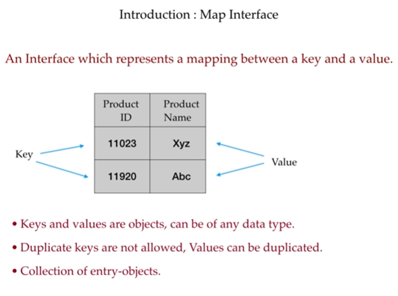

# Java Map Interface - Revision Notes

## 1. Introduction
- **`Map`** is an interface in the Java Collections Framework.
- It stores data in the form of **key-value pairs**.
- Each key maps to exactly one value.
- A `Map` does not allow duplicate keys.
- It is not a subtype of `Collection`.



## 2. Key Characteristics
- **Key-Value Structure:** Data is stored as pairs: `key -> value`.
- **Unique Keys:** No two entries can have the same key.
- **Duplicate Values Allowed:** Different keys may store the same value.
- **No Indexing:** You cannot access elements by index like in `List`.
- **Order Depends on Implementation:** Some `Map` implementations maintain insertion order, while others do not.

> **Note:** `Map` is ideal when you need to associate one object with another, like a student ID with a student name, or a word with its meaning.

## 3. Hashing Concept in `Map`

### What is Hashing?
Hashing is a way to convert an object into a number so Java can quickly decide where to store or find it in a hash-based collection like `HashMap`.

- `hashCode()` is a method from the `Object` class.
- It returns an integer value for an object.
- This integer is not random; it is computed from the object's contents or state.
- The hash value is then used to find the correct bucket/index in the internal array.
- `equals()` is used to compare whether two objects are logically the same.

### How is the hash code determined?
Java does not calculate `hashCode()` in a magical way. It follows a formula defined by the object type.

For example:

```java
String s = "ABC";
System.out.println(s.hashCode());
```
For strings, Java computes the hash based on the characters in the string.

A simplified idea is:
```java
hash = (firstChar * 31^n) + ...
```
This is why two strings with the same characters produce the same hash code.

Example:
```java
String a = "hello";
String b = "hello";
System.out.println(a.hashCode());
System.out.println(b.hashCode());
```
Both produce the same value because the contents are the same.

For custom objects, the hash code is usually calculated from fields like `id`, `name`, etc.

```java
class Student {
    String name;
    int rollNo;

    @Override
    public int hashCode() {
        return 31 * name.hashCode() + rollNo;
    }
}
```

This means the hash code depends on the object's data.

### What is a Collision?
A collision happens when two different keys produce the same hash code.

Example:
```java
String s1 = "Aa";
String s2 = "BB";

System.out.println(s1.hashCode());
System.out.println(s2.hashCode());
```
Sometimes different values can produce the same hash code. This is called a **collision**.

Collision is normal in hashing; it does not mean the data is wrong.

### Why does collision happen?
A hash code is an integer, but there are many possible objects and only a limited range of integers. So different objects may naturally map to the same hash value.

For example:
```java
key1 -> 120
key2 -> 120
```
Both keys have the same hash value, so Java places them in the same bucket.

### How does `HashMap` handle collision?
When a collision occurs, Java stores multiple entries in the same bucket. In modern `HashMap`, it uses:
- a linked list or tree inside the bucket
- then compares keys using `equals()` to find the correct one

So:
- hash tells Java where to look quickly
- `equals()` confirms whether the keys are really the same

### Simple Real-World Example
Imagine 10 lockers in a school.
- Each student gets a locker number based on their roll number.
- If two students get the same locker number, that's a collision.
- The office then checks the student name to know which student it is.

Same idea with `HashMap`:
- hash code decides the bucket
- collision means multiple keys share same bucket
- `equals()` helps decide which exact key it is

### Important rule again
If two objects are equal:
```java
obj1.equals(obj2) == true
```
then they must have the same hash code:
```java
obj1.hashCode() == obj2.hashCode()
```
This is required for correct behavior in `HashMap`.

### In one sentence
A hash code is a number generated from object data, and a collision is when two different objects produce the same hash code.

### Why are `hashCode()` and `equals()` important?
In a `Map`, keys are stored based on their hash value. If two keys are considered equal by `equals()`, then their `hashCode()` must also be the same.

```java
class Student {
    String name;
    int id;

    public Student(String name, int id) {
        this.name = name;
        this.id = id;
    }

    @Override
    public boolean equals(Object obj) {
        if (this == obj) return true;
        if (!(obj instanceof Student)) return false;
        Student s = (Student) obj;
        return this.id == s.id && this.name.equals(s.name);
    }

    @Override
    public int hashCode() {
        return Objects.hash(name, id);
    }
}
```

### Important Rule
If:
```java
obj1.equals(obj2) == true
```
then:
```java
obj1.hashCode() == obj2.hashCode()
```

This rule ensures that equal objects are placed in the same bucket, allowing proper lookup and retrieval in `HashMap`.

### HashMap Internal Working
A `HashMap` uses an array of buckets. The key's `hashCode()` is calculated and mapped to an index.

- Step 1: Compute `hashCode()`
- Step 2: Convert hash to an index using formula
- Step 3: Place the key-value pair in the corresponding bucket
- Step 4: If multiple keys produce the same bucket index, they are stored in a linked list or tree structure (collision handling)

### Collision
A collision happens when two different keys generate the same hash value.

Example:
```java
String s1 = "abc";
String s2 = "abc";
System.out.println(s1.hashCode());
System.out.println(s2.hashCode());
```
Both produce the same hash code because the string content is the same.

### Real-Life Example
Suppose you store a student's roll number as a key:
```java
Map<Integer, String> studentMap = new HashMap<>();
studentMap.put(101, "Amit");
studentMap.put(102, "Riya");
```
Java internally computes the hash of `101`, `102`, and stores them in corresponding buckets.

### Summary of Hashing
- `hashCode()` helps in fast lookup.
- `equals()` checks equality of objects.
- Hashing reduces search time in `HashMap`.
- Equal keys must have the same hash code.
- Different keys may have the same hash value, but this is handled internally as a collision.

## 4. Common Implementations

### 1. `HashMap`
- Most commonly used implementation.
- Stores elements in a hash table.
- **Fast access** for `get()` and `put()` operations: average `O(1)`.
- **Does not preserve insertion order**.
- Allows one `null` key and multiple `null` values.

```java
Map<String, Integer> marks = new HashMap<>();
marks.put("Amit", 90);
marks.put("Riya", 85);
System.out.println(marks.get("Amit")); // 90
```

### 2. `LinkedHashMap`
- Extends `HashMap`.
- Maintains **insertion order**.
- Slightly slower than `HashMap` but keeps order predictable.

```java
Map<String, Integer> map = new LinkedHashMap<>();
map.put("First", 1);
map.put("Second", 2);
for (Map.Entry<String, Integer> entry : map.entrySet()) {
    System.out.println(entry.getKey() + " -> " + entry.getValue());
}
```

### 3. `TreeMap`
- Implements `NavigableMap`.
- Stores keys in **sorted order** (natural ordering or custom comparator).
- Slower than `HashMap` due to sorting overhead.

```java
Map<String, Integer> treeMap = new TreeMap<>();
treeMap.put("Banana", 3);
treeMap.put("Apple", 1);
System.out.println(treeMap); // sorted by key
```

### 4. `Hashtable`
- Legacy class.
- Synchronized and thread-safe.
- Slower than `HashMap`.
- Does not allow `null` keys or `null` values.

### 5. `ConcurrentHashMap`
- Designed for concurrent/multi-threaded usage.
- Better performance than `Hashtable` for multithreading.

## 5. Important Methods in `Map`

| Method | Description |
| :--- | :--- |
| `put(K key, V value)` | Inserts a key-value pair |
| `get(Object key)` | Returns the value for the given key |
| `remove(Object key)` | Removes the entry for the key |
| `containsKey(Object key)` | Checks whether the key exists |
| `containsValue(Object value)` | Checks whether the value exists |
| `size()` | Returns the number of entries |
| `isEmpty()` | Checks if map is empty |
| `clear()` | Removes all entries |
| `keySet()` | Returns all keys |
| `values()` | Returns all values |
| `entrySet()` | Returns all key-value pairs |
| `putIfAbsent(K key, V value)` | Inserts only if key is absent |
| `replace(K key, V value)` | Replaces value for the key |

## 6. Basic Example

```java
import java.util.*;

public class MapDemo {
    public static void main(String[] args) {
        Map<String, Integer> map = new HashMap<>();

        map.put("Java", 90);
        map.put("Python", 85);
        map.put("C++", 80);

        System.out.println(map.get("Java")); // 90
        System.out.println(map.containsKey("Python")); // true
        System.out.println(map.size()); // 3

        for (Map.Entry<String, Integer> entry : map.entrySet()) {
            System.out.println(entry.getKey() + " : " + entry.getValue());
        }
    }
}
```

## 7. Iterating a Map

### A. Using `entrySet()`
```java
for (Map.Entry<String, Integer> entry : map.entrySet()) {
    System.out.println(entry.getKey() + " -> " + entry.getValue());
}
```

### B. Using `keySet()`
```java
for (String key : map.keySet()) {
    System.out.println(key + " -> " + map.get(key));
}
```

### C. Using `values()`
```java
for (Integer value : map.values()) {
    System.out.println(value);
}
```

## 8. `HashMap` vs `LinkedHashMap` vs `TreeMap`

| Feature | `HashMap` | `LinkedHashMap` | `TreeMap` |
| :--- | :--- | :--- | :--- |
| Order | No guaranteed order | Insertion order | Sorted ascending order |
| Performance | Fastest | Fast | Slower than HashMap |
| Null Keys | Yes (1 null key) | Yes (1 null key) | No |
| Duplicate Keys | Not allowed | Not allowed | Not allowed |
| Use Case | General purpose | Maintain insertion order | Sorted data |

## 9. Common Interview Questions

### Q1. Can a `Map` have duplicate keys?
- **No.** Keys must be unique.

### Q2. Can `Map` store duplicate values?
- **Yes.** Different keys may have the same value.

### Q3. Is `Map` a part of `Collection`?
- **No.** `Map` is a separate interface in the Java Collections Framework.

### Q4. Which `Map` maintains insertion order?
- `LinkedHashMap`.

### Q5. Which `Map` stores keys in sorted order?
- `TreeMap`.

## 10. Quick Summary
- `Map` stores data as **key-value pairs**.
- Keys are **unique**, values may be **duplicate**.
- Best for lookup-based operations.
- Common implementations:
  - `HashMap` → general purpose, fast
  - `LinkedHashMap` → insertion order
  - `TreeMap` → sorted order
  - `Hashtable` → legacy synchronized version

> **Remember:** Use `Map` when you want quick retrieval of data by key, not by index.

## 11. Very Short Revision
```java
Map<String, Integer> map = new HashMap<>();
map.put("A", 10);
map.put("B", 20);
System.out.println(map.get("A"));
System.out.println(map.containsKey("B"));
```

This is the basic idea of `Map` in Java: store data in key-value pairs and retrieve it efficiently using the key.
