# Java Collection Set - Revision Notes

## 1. Introduction to Set
- Set is a part of Java Collections Framework.
- It stores only unique elements.
- It does not allow duplicate values.
- Set does not maintain index positions like List.
- It is mainly used when uniqueness matters.

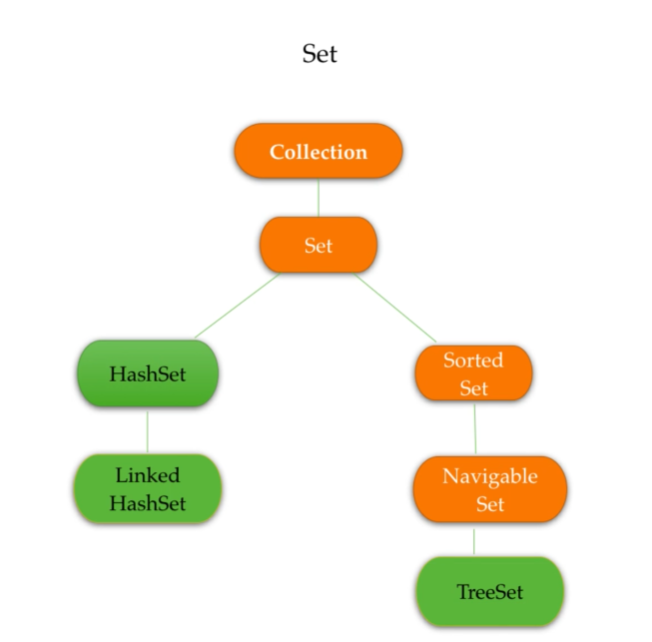

## 2. Key Characteristics of Set
- No duplicate elements are allowed.
- No positional access like `get(index)`.
- Elements are not stored in a predictable order by default.
- It is used for membership testing and uniqueness checks.

### Common Set Implementations
- `HashSet`
- `LinkedHashSet`
- `TreeSet`
- `SortedSet`
- `NavigableSet`


## 3. HashSet
`HashSet` is the most commonly used implementation of `Set`.

### Features
- Uses hashing technique.
- Does not maintain insertion order.
- Allows only unique elements.
- Performance is very fast for insertion, deletion, and search.

### Example
```java
Set<String> set = new HashSet<>();
set.add("Java");
set.add("Python");
set.add("Java");

System.out.println(set); // [Java, Python]
```

### Internal Working of HashSet
`HashSet` uses `hashCode()` and `equals()` to store and retrieve elements efficiently.

- Hash code helps in locating the bucket.
- If hash matches, `equals()` checks whether objects are same.
- If different objects have same hash, it is called a collision.

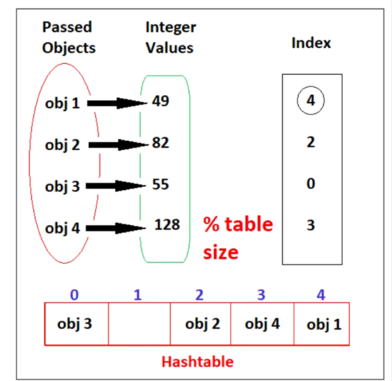

## 4. LinkedHashSet
`LinkedHashSet` is similar to `HashSet`, but it maintains insertion order.

### Features
- Unique elements only.
- Keeps insertion order.
- Slightly slower than `HashSet` because it maintains a linked list.

### Example
```java
Set<String> set = new LinkedHashSet<>();
set.add("Banana");
set.add("Apple");
set.add("Mango");
set.add("Banana");

System.out.println(set); // [Banana, Apple, Mango]
```

## 5. TreeSet
`TreeSet` stores elements in sorted order.

### Features
- Sorted ascending order by default.
- No duplicates allowed.
- Slower than `HashSet` because it sorts the elements.
- Implemented using a tree structure.

### Example
```java
Set<Integer> set = new TreeSet<>();
set.add(30);
set.add(10);
set.add(20);
set.add(10);

System.out.println(set); // [10, 20, 30]
```

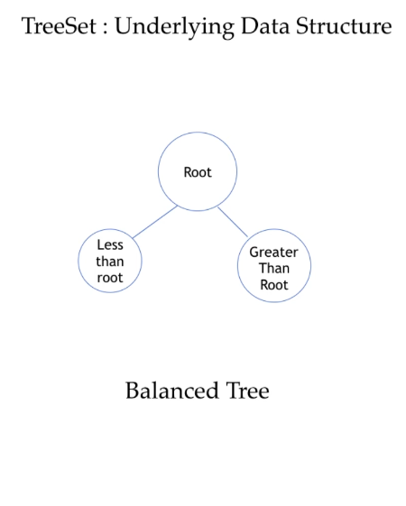

## 6. SortedSet and NavigableSet
`TreeSet` implements `SortedSet` and `NavigableSet`.

### SortedSet
- Keeps elements in sorted order.
- It is a view of a set where elements are always arranged in ascending order.
- It provides methods like:
  - `first()` → first element
  - `last()` → last element
  - `headSet(E e)` → elements before `e`
  - `tailSet(E e)` → elements from `e` onward
  - `subSet(E from, E to)` → range between `from` and `to`

### Example: `SortedSet`
```java
SortedSet<Integer> set = new TreeSet<>();
set.add(50);
set.add(10);
set.add(30);

System.out.println(set);            // [10, 30, 50]
System.out.println(set.first());     // 10
System.out.println(set.last());      // 50
System.out.println(set.headSet(30)); // [10]
System.out.println(set.tailSet(30)); // [30, 50]
```

### NavigableSet
- Extends `SortedSet`.
- It provides navigation-related operations to find nearest elements.
- Useful when you need to search around a value.
- Common methods:
  - `ceiling(E e)` → smallest element >= e
  - `floor(E e)` → greatest element <= e
  - `higher(E e)` → smallest element > e
  - `lower(E e)` → greatest element < e
  - `pollFirst()` → removes and returns first element
  - `pollLast()` → removes and returns last element

### Example: `NavigableSet`
```java
NavigableSet<Integer> set = new TreeSet<>();
set.add(10);
set.add(20);
set.add(30);

System.out.println(set.ceiling(25)); // 30
System.out.println(set.floor(25));   // 20
System.out.println(set.higher(20));  // 30
System.out.println(set.lower(20));   // 10
System.out.println(set.pollFirst());  // 10
System.out.println(set);              // [20, 30]
```

### Why is `SortedSet` important?
It is useful when you need elements in a sorted order and also want to work with ranges.

### Why is `NavigableSet` important?
It is useful when you need to search the next or previous values efficiently.

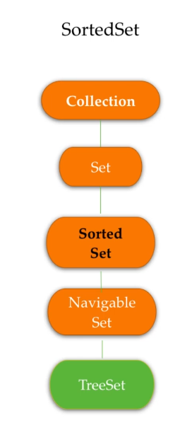
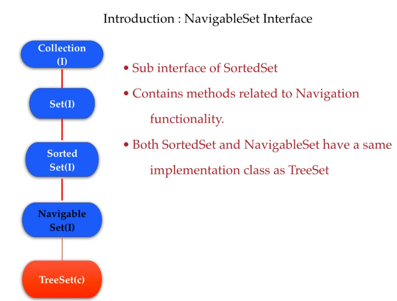

## 7. Common Methods of Set Interface
The `Set` interface provides methods common to all Set implementations.

| Method | Description |
| :--- | :--- |
| `add(E e)` | Adds an element if it is not already present |
| `remove(Object o)` | Removes the specified element |
| `contains(Object o)` | Checks whether the element exists |
| `size()` | Returns the number of elements |
| `isEmpty()` | Checks if set is empty |
| `clear()` | Removes all elements |
| `iterator()` | Returns iterator to traverse the set |
| `containsAll(Collection c)` | Checks whether all elements of collection are present |
| `addAll(Collection c)` | Adds all elements from another collection |
| `removeAll(Collection c)` | Removes all elements from the given collection |
| `retainAll(Collection c)` | Keeps only common elements |

### Example
```java
Set<String> set = new HashSet<>();
set.add("Java");
set.add("C++");
set.add("Python");

System.out.println(set.contains("Java")); // true
System.out.println(set.size());            // 3
set.remove("C++");
System.out.println(set);                   // [Java, Python]
```

## 8. Comparable vs Comparator
Sorting in Java can be done using either `Comparable` or `Comparator`.

### Comparable
- It is used inside the class itself.
- The class implements `Comparable`.
- It defines natural ordering.

```java
class Student implements Comparable<Student> {
    int rollNo;

    @Override
    public int compareTo(Student s) {
        return this.rollNo - s.rollNo;
    }
}
```

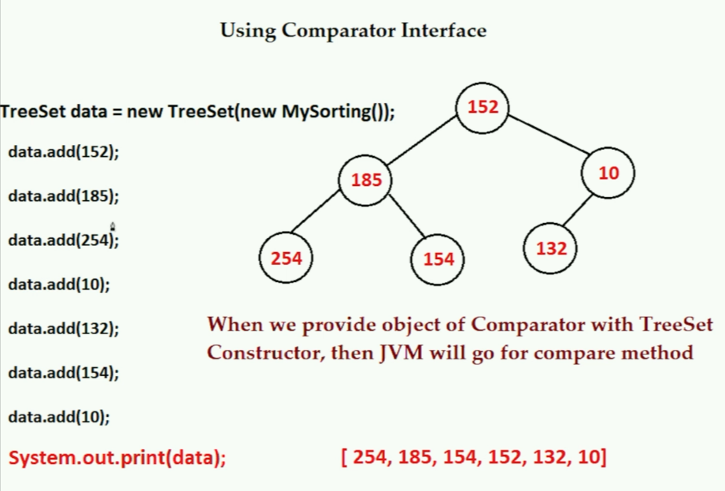
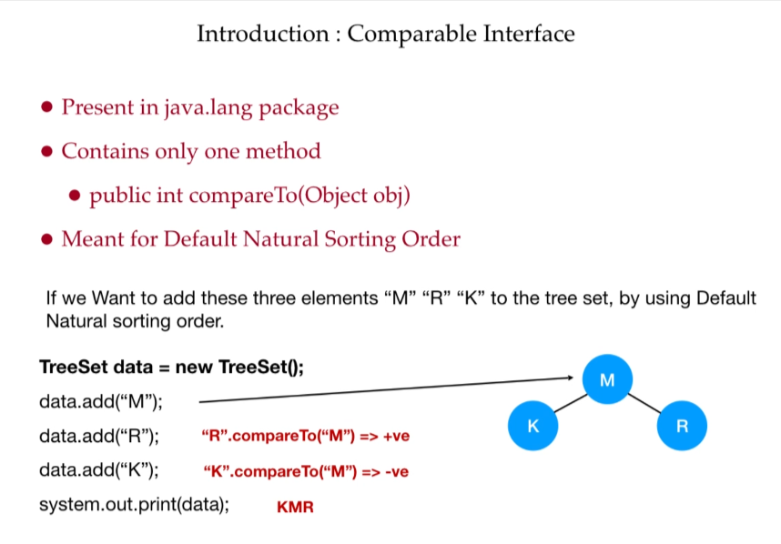

### Comparator
- It is used externally.
- It is implemented separately from the class.
- Useful when you want multiple sorting orders.

```java
Comparator<Student> byName = Comparator.comparing(s -> s.name);
```

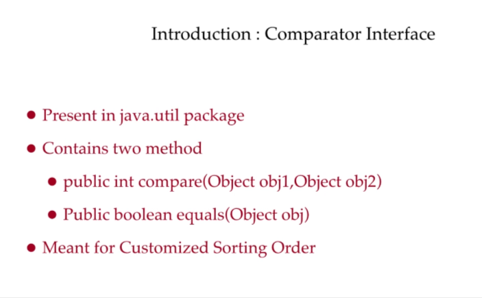
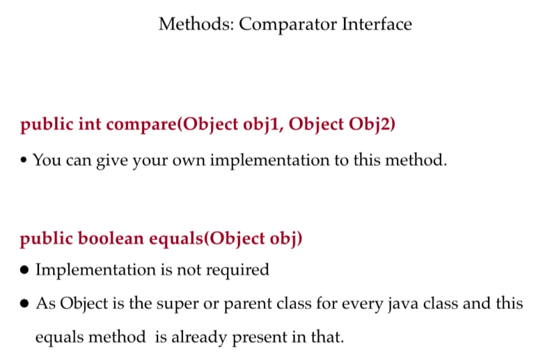

## 9. Sorting Process in Set
Sorting is done when using `TreeSet` or when sorting a collection manually.

### Steps in sorting
1. Compare elements.
2. Arrange them in natural order or custom order.
3. Store unique elements in sorted order.

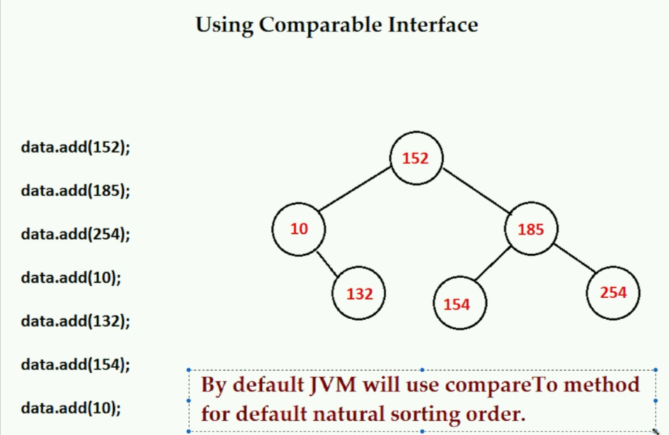

## 10. Difference Between List and Set
| Feature | List | Set |
| :--- | :--- | :--- |
| Duplicates | Allowed | Not allowed |
| Order | Maintains insertion order | Not guaranteed |
| Access by index | Yes | No |
| Use case | Ordered data | Unique data |

## 11. HashSet vs LinkedHashSet vs TreeSet
| Feature | HashSet | LinkedHashSet | TreeSet |
| :--- | :--- | :--- | :--- |
| Order | No order | Insertion order | Sorted order |
| Performance | Fastest | Fast | Slower |
| Duplicate elements | Not allowed | Not allowed | Not allowed |
| Use case | General purpose | Preserve order | Sorted data |

## 12. Important Interview Questions
### Q1. Does Set allow duplicate elements?
No, Set does not allow duplicates.

### Q2. Which Set preserves insertion order?
`LinkedHashSet`.

### Q3. Which Set stores elements in sorted order?
`TreeSet`.

### Q4. Which interface is parent of `SortedSet`?
`Set`.

### Q5. Why is `HashSet` faster?
Because it uses hashing with `hashCode()` and `equals()`.

## 13. Quick Summary
- Set stores only unique elements.
- `HashSet` is fastest and unordered.
- `LinkedHashSet` keeps insertion order.
- `TreeSet` stores elements in sorted order.
- `Comparable` is for natural ordering.
- `Comparator` is for custom ordering.

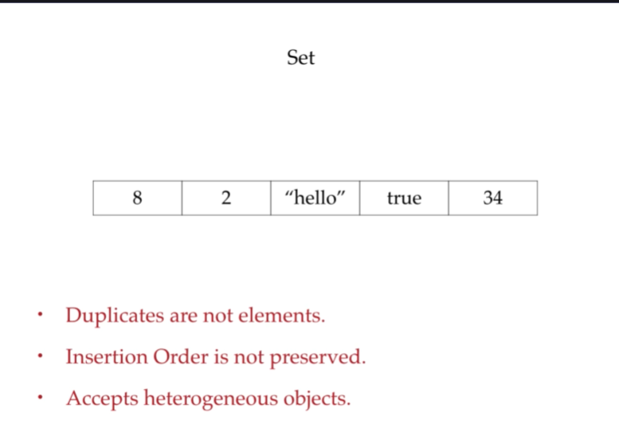
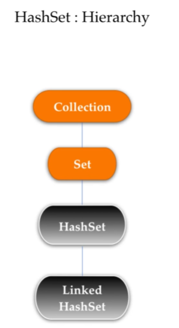

## 14. Very Short Revision
```java
Set<String> s = new HashSet<>();
s.add("Java");
s.add("Python");
s.add("Java");
System.out.println(s); // [Java, Python]
```

This is the basic idea of Set in Java: it stores only unique elements and prevents duplicates.
